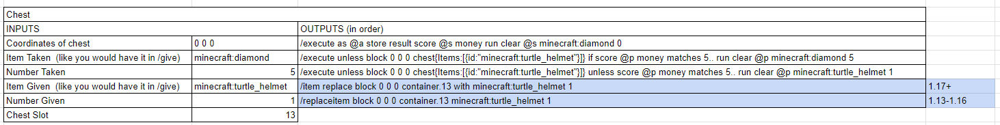
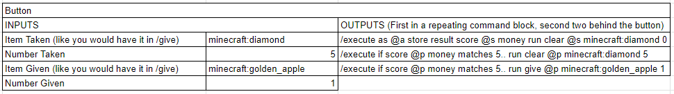

## COMANDOS DE AUTOMAÇÃO #minecraftCommands

### LÓGICA BASICA:

1. O CB FICA EM "ALWAYS ACTIVE" CONTANDO QUANTAS UNIDADES DO ITEM "A" EXISTEM NO INVENTARIO;

2. O CB CRIA UM ITEM "B" EM UM BAU DE LOCALIZAÇÃO X Y Z EM UM DOS SLOTS DO BAU (FORMATO MATRIZ 9X3 : 27 POSIÇÕES);

3. QUANDO O PLAYER PEGAR O ITEM "B" SERÁ REMOVIDO O ITEM "A" DO INVENTARIO (INCLUINDO ENDER CHEST SLOTS);

4. CASO O PLAYER NÃO POSSUIR O ITEM "A" OU NÃO FOR A QUANTIDADE MINIMA O ITEM B É REMOVIDO DO INVENTÁRIO.

### BUGS E NOTAS:

* É POSSIVEL SOLICITAR VARIOS ITENS "A" MAS SÓ É POSSIVEL ENTREGAR 1 UNIDADE DE ITEM "B"

* AS VEZES O PODEM ACONTECER BUGS ONDE O ITEM "B" É PEGO SEM A QUE O PLAYER TENHA NENHUM ITEM "A" MAS O ITEM FICA BUGADO E SEM UTILIZAÇÃO, SUMINDO QUANDO CONSUMIDO OU POUCOS TICS DEPOIS.

* HOUVERAM RELATOS DE PLAYERS QUE TIVERAM ITENS "A" REMOVIDOS SEM RECEBER "B", MAS NÃO POSSUEM EVIDENCIAS SUFICIENTES (TALVEZ LAG DO SERVIDOR OU DO PLAYER?).

* QUANDO SE CLICA DEMASIADO RÁPIDO O JOGO PODE DEMORAR ALGUNS SEGUNDOS PARA ENTREGAR TODOS ITENS "B" SOLICITADOS.

### VIDEO DEMONSTRATIVO:

LINK: [YOUTUBE](https://www.youtube.com/watch?v=JtVfrL48XEo)